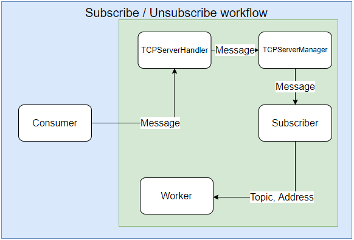
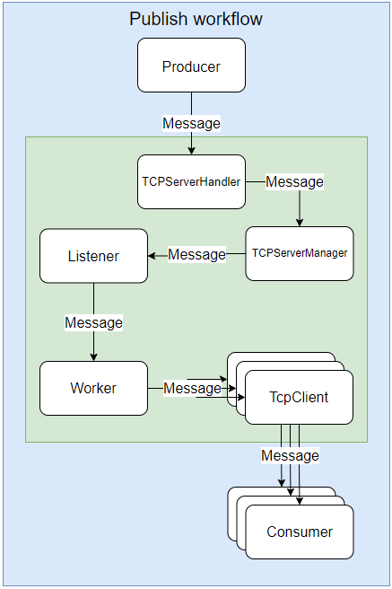

# PTRLab3

University laboratory nr. 3 for Real Time Programming course

# Technologies

- Message broker:
    - Scala == 2.13.1
    - Akka == 2.6.19
- Producer:
    - python == 3.9
    - sseclient-py ~= 1.7.2
- Consumer:
    - python == 3.9

# Actors
- `Main supervisor`: The supervisor that starts the `Subscriber` and the `Pipeline` actors.
- `Pipeline`: Supervisor for `Listener` and `Worker` actors.
- `Subscriber`: The actor that receives subscribe/unsubscribe requests as JsonMessages from `TcpServerManager`.
Forwards `Worker` actors which consumer to subscribe/unsubscribe to what topic.
- `Listener`: Supervisor for `TcpServerManager` and `TcpServerHandler`. Forward messages from `TcpServerManager` to `Worker` actors.
- `TcpServerManager`: Actor that manages the TCP connection and forwards JsonMessages to `Listener`.
- `TcpServerHandler`: Actor that handles the TCP packets serializes them into JsonMessages and forwards them to `TcpServerManager`.
- `Worker`: Actor that sends the correct messages to the corresponding consumers using `TcpClient`.

# Actor input-output

- `Worker`: 
  - Input: `JsonMessage`, `SubscribeConsumer`, `UnsubscribeConsumer`.
  - Output: `JsonMessage`.
- `Subscriber`: 
  - Input: `JsonMessage`.
  - Output: `SubscribeConsumer`, `UnsubscribeConsumer`.
- `Listener`:
  - Input: `JsonMessage`.
  - Output: `JsonMessage`.
- `TcpServerManager`:
  - Input: `JsonMessage`.
  - Output: `JsonMessage`.
- `TcpServerHandler`:
  - Input: `ByteString`.
  - Output: `JsonMessage`.
- `TcpClient`:
  - Input: `JsonMessage`.
  - Output: `ByteString`.
- `Pipeline`:
  - Input: `CreateListener`.
  - Output: None.

# IO Classes
- `JsonMessage` is a class that contains string message and a sender, the message being easily processed into a json object.
- `SubscribeConsumer` is a class that contains a topic and a consumer.
- `UnsubscribeConsumer` is a class that contains a topic and a consumer.
- `CreateListener` is a class that contains a port number.
# Endpoints

- `localhost:9999` endpoint for the `Subscriber` actor. Accepts json messages that contain:
    - Operation: `"operation" : "subscribe"` or `"operation" : "unsubscribe"`
    - Topics: `"topic" : ["topic1", "topic2", "topic3"]`
    - Consumer_address: `"consumer_address" : "localhost:xxxxx"`
- `localhost:9000` endpoint for the first `Listener` actor. Accepts json messages from docker image.
- `localhost:9001` endpoint for the second `Listener` actor. Accepts json messages from docker image.

# Supervision tree

# Subscribe and unsubscribe workflow

# Publish workflow

