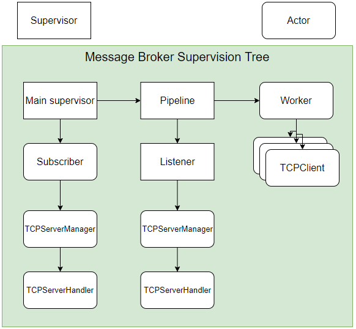

# PTRLab3

University laboratory nr. 3 for Real Time Programming course

# Technologies

- Scala
- Akka framework
- more?

# Actor

- `Main supervisor`: Actor that starts the `ListenerGroup`, `Balancer` and `Subscriber` actors.
- `ListenerGroup`: Actor that creates and supervises `Listener` actors.
- `Balancer`: Actor that creates `Worker Group` actors.
- `Worker Group`: Actor that creates `Worker` actors.
- `Subscriber`: Actor that binds one `Worker group` actor to one `Listener group` actor when a producer subscribes.
- `Worker`: Actor that sends the messages to the consumers.
- `Listener`: Actor that receives messages from the producers. Sends the messages to the corresponding `Worker Group`
  actor.

# Actor input-output

- `ListenerGroup`: Receives message that contains an address to a worker group to create `Listener` actors.
- `WorkerGroup`: Receives messages from the `Listener` actors. Sends the messages to the `Worker` actors.
- `Worker`: Receives message and Consumer address from the `Worker Group` actors. Sends the messages to the Client.
- `Subscriber`: Receives subscription requests from Clients or Producers.
- `Listener`: Receives messages from a Producer. Sends the messages to the according `Worker Group` actor.

# Endpoints

- `http://localhost:8080/prod_subscribe`: endpoint for the `Subscriber` actor for subscription of producers.
- `http://localhost:8080/prod_unsubscribe`: endpoint for the `Subscriber` actor for unsubscription of producers.
- `http://localhost:8080/client_subscribe`: endpoint for the `Subscriber` actor for subscription of clients.
- `http://localhost:8080/client_unsubscribe`: endpoint for the `Subscriber` actor for unsubscription of clients.
- `http://localhost:808x/publish`: endpoint for the x-th `Listener` actor.

# Supervision tree

# Subscribe and unsubscribe workflows

# Publish workflow

